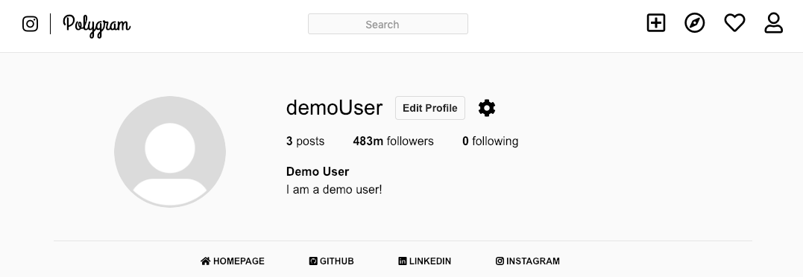

# Production README

Live Site: https://polygram-lk.herokuapp.com/#/

Polygram is a social media website inspired by Instagram, where users can share photos, provide descriptive captions, like posts, comment on posts, and follow other users to create a richer dashboard.

The backend is powered by Ruby on Rails with a PostgreSQL database. The frontend was created using React-Redux to create a simple, single-page app filled with many features.

# Features

## Signing Up / Logging In

Users can sign up and log in. Their session will persist in the front-end, even after refreshing the page.

Users' sessions are protected via modern-day encryption methods and authentication.

## Editing Profile Information

Users can edit their profile information. This feature is accessible in the user's profile page.
Users can edit their name, username, biography, and email.

## Images

All features that require image uploads (posting and profile photo) utilize the AWS cloud service, allowing the website to run faster by not saving the images into the website itself.

I used a special Rails Active Storage association (has_one_attached) to allow and have access to images that were attached to each post. By doing this, Polygram can use the AWS url that is attached to each post to display them.

## Uploading Posts

Users can upload posts by providing an image and an optional caption. When uploading users will be able to get an image preview.

The dashboard will feature posts created by the user and the users that they follow.
The user's profile page will feature posts that were only created by the user.

## Editing Posts / Deleting Posts

Users can choose to edit posts; however, they can only edit captions.
Users can also delete their posts, which will disappear from their profile page and the dashboard in real time.

## Liking Posts

Users can like and unlike posts.

## Commenting on Posts (under development)

Users can comment on any post.
If the post belongs to the user, they can delete comments belonging to any user.
If the post doesn't belong to the user, they can only delete their own comments.

## Viewing Other Users' Profiles (under development)

Users can have access to other users's profiles by clicking on their username on their post, clicking their username in a comment, or through the search feature.

By having access to another user's profile, the user can choose to follow or unfollow them.

## Following Other Users (under development)

Users can follow other users. By doing so, they will have access to posts created by other users on their dashboard.
Users can also unfollow other users. By doing so, they will lose access to posts created by other users on their dashboard.

By using Rails Association, database querying becomes more simple in development.

## Searching for Other Users (under development)

Users can search for other users based on username. By searching for a user, they will be able to view the searched user's profile page.
